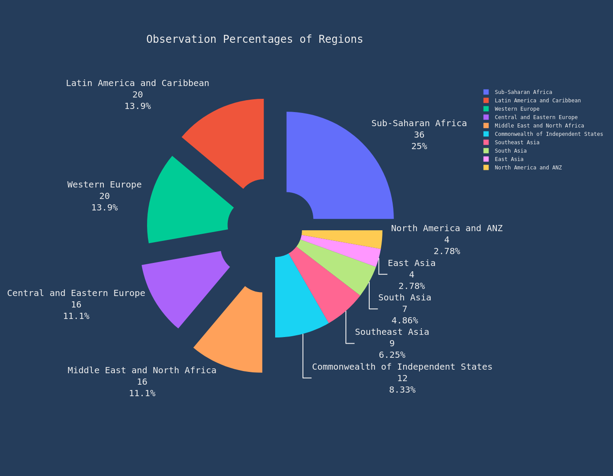

# Global-Well-Being-Analytics
 Exploring the Relationship between Happiness and Suicidal Rates
## About The Dataset

- `183 countires` on the Suicidal Dataset `[144 Common + 39 Special[ 23 Not In WHR, WHR2021 + 16 Not In WHR2021]]`
- `165 countires` on the World Happines Report Dataset `[144 Common + 5 Common WHR2021 + 16 Special]`
- `149 countires` on the WHR Dataset for 2021 `[144 Common + 5 Common WHR]`

> __Angola__,__Belize__,__Bhutan__,__Central African Republic__,__DRCongo__,__Cuba__,__Djibouti__,__Guyana__,__Oman__,__Qatar__,__Somalia__,__South Sudan__,__Sudan__,__Suriname__,__Syria__,__Trinidadand Tobago__ are in WHR but not in WHR 2021\

- `144 Countries` are in both Datasets
 > __Taiwan__ , __Kosovo__ , __Hong Kong__ , __Palestine__ , __North Cyprus__ are in `WHR`, `WHR2021` but not in `Suicidal` Dataset

# 
## Six Factors Happiness Report
`Income, health, having someone to count on, having a sense of freedom to make key life decisions, generosity, and the absence of corruption all play strong roles in supporting life evaluations.`

- `Dystopia`:  The lowest scores observed for the six key variables, therefore, characterize Dystopia.
    - Dystopia is an imaginary country that has the world’s least-happy people. The purpose of establishing Dystopia is to have a benchmark against which all countries can be favorably compared (no country performs more poorly than Dystopia) in terms of each of the six key variables 

1. `Logged GDP per capita`:	Gross Domestic Product, or how much each country produces, divided by the number of people in the country
    - GDP per capita gives information about the size of the economy and how the economy is performing
2. `Social Support`: 	“If you were in trouble, do you have relatives or friends you can count on to help you whenever you need them, or not?”
    - Social support, or having someone to count on in times of trouble.
3. `Healthy Life Expectancy`: 	More than life expectancy, how is your physical and mental health?
    - Mental health is a key component of subjective well-being and is also a risk factor for future physical health and longevity./
      Mental health influences and drives a number of individual choices, behaviours, and outcomes.
4. `Freedom to make Life Choices` : “Are you satisfied or dissatisfied with your freedom to choose what you do with your life?”
    - This also includes Human Rights. Inherent to all human beings, regardless of race, sex, nationality, ethnicity, language, religion, or any other status./
      Human rights include the right to life and liberty, freedom from slavery and torture, freedom of opinion and expression,/
      the right to work and education, and many more. Everyone is entitled to these rights without discrimination.
5. `Generosity` :  “Have you donated money to a charity in the past month?” 
    - A clear marker for a sense of positive community engagement and a central way that humans connect with each other.
    - Research shows that in all cultures, starting in early childhood, people are drawn to behaviours which benefit other people.
6. `Perception of Corruption` : 	“Is corruption widespread throughout the government or not” and  “Is corruption widespread within businesses or not?”
    - Do people trust their governments and have trust in the benevolence of others?
